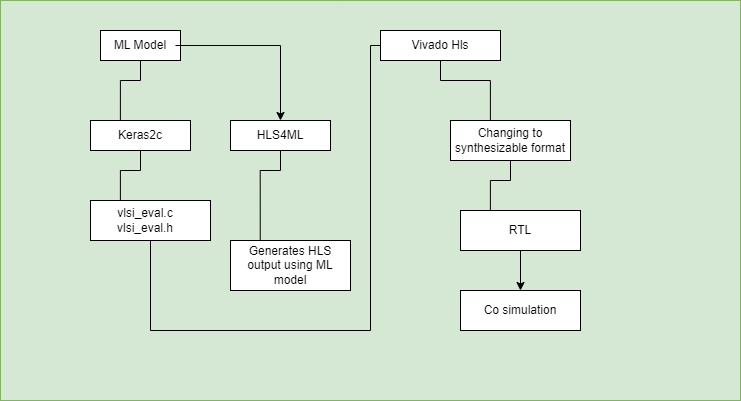

# HLS4ML Workflow

This diagram illustrates a workflow for converting an ML model into a format that can be used in high-level synthesis (HLS) for hardware implementation. The process involves several tools and steps, as outlined below:

1. **ML Model**: The starting point is a pre-trained machine learning model.
   
2. **Keras2c**: This tool is used to convert the ML model into C code, generating files such as `vlsi_eval.c` and `vlsi_eval.h`.

3. **HLS4ML**: This framework takes the C representation of the ML model and generates output suitable for high-level synthesis.

4. **Vivado HLS**: High-Level Synthesis tools like Vivado HLS are then used to convert the HLS4ML output into a synthesizable format. This step includes:
   - Changing the model into a format that can be synthesized (RTL - Register Transfer Level).
   - Performing co-simulation to verify the functionality of the RTL design.

